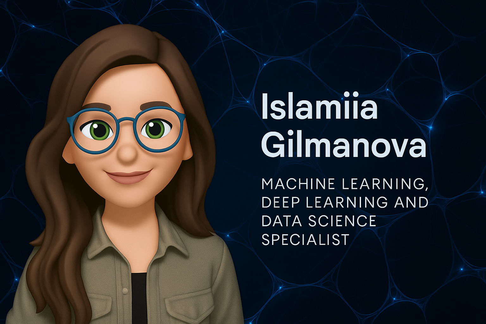

<!-- Banner -->

  

<h1 align="center">Islamiia Gilmanova</h1>

<strong>Deep Learning · Computer Vision · AI in Industry</strong>

M.Sc. student in Research in Computer and Systems Engineering at TU Ilmenau, Germany.  
Working on applied machine learning and image classification for industrial inspection systems.

  
  
  
  

---

## Research Focus

- Deep convolutional architectures with attention (SE, CBAM)
- Domain generalization and data adaptation techniques
- Lightweight model deployment (MobileNet, ONNX)
- Custom TFRecord pipelines for efficient training
- Applied machine learning in real-time classification systems

---

## Selected Projects

### Small Objects Classifier *(Public Synthetic Version)*
A binary classifier trained on synthetic 4-channel seed images, using MobileNetV2 + SE blocks.  
Adapted from internal research — no proprietary data or structures used.

**Highlights:**
- Custom data ingestion from TFRecord
- Attention-integrated MobileNetV2
- Exported to ONNX for deployment
- Evaluation: metrics, confusion matrix, class-based precision/recall

[View Repository →](https://github.com/telyotarsyn/small-objects-classifier)

---

### TFRecord Image Pipeline Template
Reusable TensorFlow pipeline for image classification with public datasets.

**Features:**
- Scalable `tf.data.Dataset` structure
- Visual preview of batch data
- Supports label balancing, augmentations, stratified splits

[View Repository →](https://github.com/telyotarsyn/tfrecord-pipeline-template)

---

## Skills & Tools

**Programming & Data:**
- Python · NumPy · Pandas · SQL · Git

**Machine Learning & AI:**
- TensorFlow · Keras · Scikit-learn · OpenCV · ONNX · Federated Learning

**Specialized Topics:**
- Neural Machine Translation  
- Differential Privacy Algorithms  
- Real-time Image Classification  
- Domain Adaptation  
- Attention Mechanisms (SE, CBAM)  
- Model Evaluation & Explainability

**Development Tools:**
- Visual Studio Code · JupyterLab · GitHub Actions · Docker · Linux

**Languages:**
- English (advanced)· · German (intermediate) · Russian (native) ·  Tatar (native)

---
## Tech & Tools I Use

  
  
  
  
  
  
  
  
  
  
  
  

---

## GitHub Activity & Stats

  
  

  

---

## Contact

- LinkedIn: [islamiia-gilmanova](https://www.linkedin.com/in/islamiia-gilmanova/)
- Email: islamiia.gilmanova@google.com

<em>This profile contains open-source analogs of my industrial research, built with public datasets.</em>

